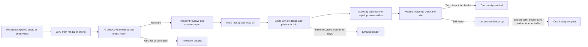
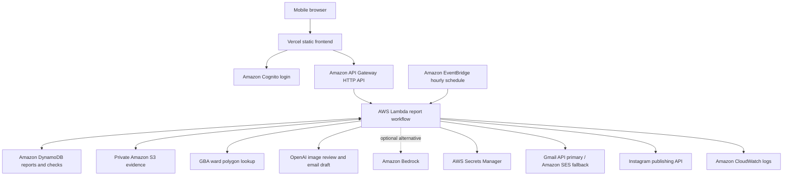

# Civicloop

**Turn a roadside problem into a trackable report, a ward-level request, and a community-verified fix.**

[Open the app](https://civicloop-coral.vercel.app/) · [See a real report](https://civicloop-coral.vercel.app/?report=bedda9e3-6c4b-4879-b98a-46659becc03d) · [View its Instagram post](https://www.instagram.com/p/DeUr0QgHZ5T/)

Civicloop is a mobile-first web app built for the **Waste and Energy** track of [WeMakeDevs Environmental Hacks](https://www.wemakedevs.org/aws/env). It also accepts visible water leaks, blocked drains, road damage, plastic burning, hazardous e-waste, and other public-space hazards. The idea is simple: the person who notices a problem should be able to document it in seconds, and the next person passing by should be able to check whether anything changed.

> **Current live example:** The linked roadside-litter photo was classified as waste dumping by the image agent, matched to Kodigehalli Ward 13, emailed with its photo attached, and published on Civicloop's Instagram account. That photo had no GPS, so its map pin is explicitly approximate. The email went to a configured **demo inbox**, not a municipal official. Ward contacts need independent verification before real authority delivery.

## The problem and the loop

A photo in a chat can disappear without a location, responsible ward, or follow-up. Civicloop keeps the evidence, status, and next action together. It does not declare a repair complete merely because an authority uploads a photo: nearby residents can independently verify it.



The Instagram path needs a distinct neighbor's **Still there** check after seven days. The authority link is private and never appears in the public post.

## What works today

| Step | Implementation |
| --- | --- |
| Capture | Mobile camera with live GPS, or up to four photos **or** one video of at most 15 seconds; previews let the reporter inspect evidence. |
| Locate | Image EXIF or supported video GPS takes priority. If absent, the app uses permission-based phone GPS. Bengaluru coordinates are matched against the 369 GBA ward polygons. |
| Review | A vision agent rejects unrelated or unclear images, then proposes category, title, details, and summary from visible evidence. The reporter reviews the result before creating the report. |
| Limit abuse | Five submission attempts per signed-in user per India-local day, including failed creation attempts; at most one video report. Rejected images at the review step do not consume an attempt. |
| Route | Configured ward email takes priority. An unconfigured ward is clearly marked and routed to the demo inbox. The email includes a small attached image or a time-limited evidence link, a directions link, and a private repair link. |
| Close the loop | The repair link accepts one fix photo or video without an authority sign-in. A location check limits uploads to the report area; two distinct residents' fix checks mark it community verified. |
| Follow up | A scheduled AWS job can resend an unresolved report after three days. After seven days, an opted-in report with a new neighbor check can make one Instagram post. |
| Browse | Shared map and feed for Bengaluru and Delhi; foreground browser location can alert a signed-in passerby to nearby issues. |

**Accuracy boundaries:** A ward polygon identifies a ward, not the exact civic department or its email. Delhi ward polygons and verified ward contacts are not yet included. Browser proximity alerts work while Civicloop is open; mobile browsers do not provide reliable background GPS. The app labels approximate pins, demo recipients, and AI drafts rather than presenting them as confirmed field facts.

## Architecture

The live frontend is served from **Vercel**. The report system is deployed in the project's assigned AWS Region, `ap-south-1`. AWS hosts the authenticated API, evidence, reports, secrets, scheduled follow-up, and email fallback. This satisfies the hackathon's deployed-on-AWS route; the demo video should show an actual AWS resource and a working report, not just this diagram.



Images and short video frames are reviewed by `gpt-4o-mini` when the OpenAI key is configured. Bedrock is an alternative when its model is enabled in the selected Region. The AI proposes text; server-side checks enforce evidence limits, ward lookup, ownership, quota, consent, and dispatch. Evidence stays in private S3; browser uploads and downloads use short-lived signed URLs. Secrets are held server-side in AWS Secrets Manager. Public report responses omit the reporter's Cognito ID and private S3 object key.

The Instagram publisher includes the public report link, ward, issue hashtags, `@bbmp.swm`, and `@deobbmp` in caption **text**. Instagram Login publishing does not provide account tagging through this integration. A failed or uncertain publish is held for review instead of blindly retried.

## Try it in three minutes

1. Open the [live app](https://civicloop-coral.vercel.app/) on a phone or in a narrow browser window. Explore the map and feed, then sign in to create a report.
2. Choose **Live camera** or **Add evidence**, allow location, and watch the image review fill the report draft. An unrelated image should be rejected before report creation.
3. Review the category, ward, evidence, and recipient. Create the report and show its map pin and public detail link.
4. Show the email's attached evidence and private repair link in the configured inbox. If a ward contact is not configured, explain that this is demo delivery.
5. Show how a passerby marks **Still there** or **Fixed**, and how repair evidence remains subject to community verification.
6. Show the API, Lambda, DynamoDB, and S3 resources in the AWS Management Console. If showing an Instagram post, disclose whether its location is exact or approximate.

For the hackathon video, keep this walkthrough **under three minutes** and upload it to YouTube as public or unlisted. The [official rules](https://www.wemakedevs.org/aws/env/rules) require a public repository, the video, and a short writeup covering the problem, build, and AWS's role. Judges will see the submitted video rather than a live demo, so prioritize the working path over a feature list.

Suggested edit: **0:00–0:20** show the roadside problem; **0:20–1:15** capture, GPS, AI review, and ward; **1:15–2:05** show the emailed evidence and repair link; **2:05–2:35** show neighbor verification and the report status; **2:35–2:55** show the AWS resources that made the flow work. Leave a few seconds for the project name and links. Use a real report but keep private repair tokens out of the recording.

## Run locally

Requirements: Node.js 22+, AWS CLI authenticated for the project's selected Region, and AWS SAM CLI for backend deployment. Local map and sample reports can run without cloud credentials.

```sh
python3 -m http.server 8080
```

Open `http://localhost:8080`. With an empty `config.js`, this is a **local demo**; authenticated report creation and AI review require the deployed backend.

## Configure and deploy

1. Copy `.env.example` to the ignored `.env`. Set `AWS_REGION` to the Region assigned to your AWS project; confirm it in **AWS Settings → View all projects → Overview → Additional Info → Region**. For this project, it is `ap-south-1`.
2. Add `OPENAI_API_KEY` and `OPENAI_SECRET_ID=civicloop/openai` to use the budget image-review model. Deployment copies the key to AWS Secrets Manager. A direct `BEDROCK_MODEL_ID` in the same Region can be used instead; cross-Region inference is not part of this deployment.
3. Configure `GMAIL_FROM_EMAIL`, Google OAuth client credentials, and `GMAIL_REFRESH_TOKEN` for Gmail API sending. `SES_FROM_EMAIL` is the verified SES fallback. Set `DEMO_INBOX_EMAIL` for a safe demo. Add only **verified** municipal contacts to `AUTHORITY_EMAILS_JSON`; the map cannot supply their email addresses. SES sandbox recipients must be verified until production sending is approved.
4. Add Instagram professional-account credentials only if publishing is needed. The account needs `instagram_business_basic` and `instagram_business_content_publish` permissions. Keep the token in `.env`; deployment stores it in Secrets Manager.
5. Deploy with `AWS_PROFILE=sai node scripts/deploy.mjs`, replacing `sai` if your profile differs. The script creates or updates the SAM stack and writes public API/Cognito identifiers to `config.js`. Commit and push `config.js` so Vercel receives the current endpoints.

The frontend receives no AWS access keys or private mail, OpenAI, or Instagram credentials. Deploying cloud resources and model calls can consume credits. To publish one specifically opted-in report, first run `node scripts/post-latest-instagram.mjs --report REPORT_ID --preview`, then run it without `--preview`. The publisher records the returned media ID to prevent an automatic duplicate.

## Submission notes

- **Primary track:** Waste and Energy. Roadside dumping, plastic burning, and e-waste are the clearest examples; water leaks demonstrate that the same workflow can cover the Heat and Water track's issues.
- **AWS contribution:** SAM deploys API Gateway, Lambda, Cognito, DynamoDB, private S3, EventBridge scheduling, CloudWatch logs, Secrets Manager access, and SES fallback. The frontend can be hosted elsewhere while the reporting workflow runs on AWS.
- **Proven result:** The [Kodigehalli report](https://civicloop-coral.vercel.app/?report=bedda9e3-6c4b-4879-b98a-46659becc03d) passed image review, was stored with Ward 13, sent through Gmail to a demo inbox with a photo attachment, and produced [this Instagram post](https://www.instagram.com/p/DeUr0QgHZ5T/). The supplied image lacked GPS, so the pin is approximate. This demonstrates the workflow, not verified authority delivery or cleanup.
- **Submission still needed:** Record and upload the under-three-minute YouTube demo; add its link and the short writeup to the hackathon submission form before its stated deadline. Student registration and AWS Builder Center verification are handled outside this repository.
- **AI-assisted development disclosure:** Codex was used to help implement and document Civicloop. The application uses OpenAI for image review and email drafting when configured. Review and credit any additional tools used in the final submission.

## Data and credits

Bengaluru ward boundaries come from the Greater Bengaluru Authority data published through [OpenCity](https://data.opencity.in/dataset/gba-wards-delimitation-2025) under ODbL 1.0; see [`backend/data/README.md`](backend/data/README.md) for attribution and limits. The map uses OpenStreetMap data and tiles with attribution in the UI. This project has no affiliation with BBMP or any government body. Resident reports and AI descriptions are not independent findings; authority repair submissions still need neighbor verification.

Key implementation files: [`template.yaml`](template.yaml) (AWS infrastructure), [`backend/handler.mjs`](backend/handler.mjs) (report workflow), [`backend/ward-lookup.mjs`](backend/ward-lookup.mjs) (ward matching), [`app.js`](app.js) (mobile UI), and [`scripts/deploy.mjs`](scripts/deploy.mjs) (deployment).
